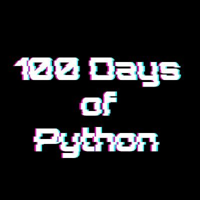

# 100 Days of Code by Python

##

- <b>Day 1</b> - [Working with Variables in Python to Manage Data](https://github.com/MHalemDEV2022/100_Days_of_Code/tree/main/%5B1%5D%20Day_1)

- <b>Day 2</b> - [Understanding Data Types and How to Manipulate Strings](https://github.com/MHalemDEV2022/100_Days_of_Code/tree/main/%5B2%5D%20Day_2)
